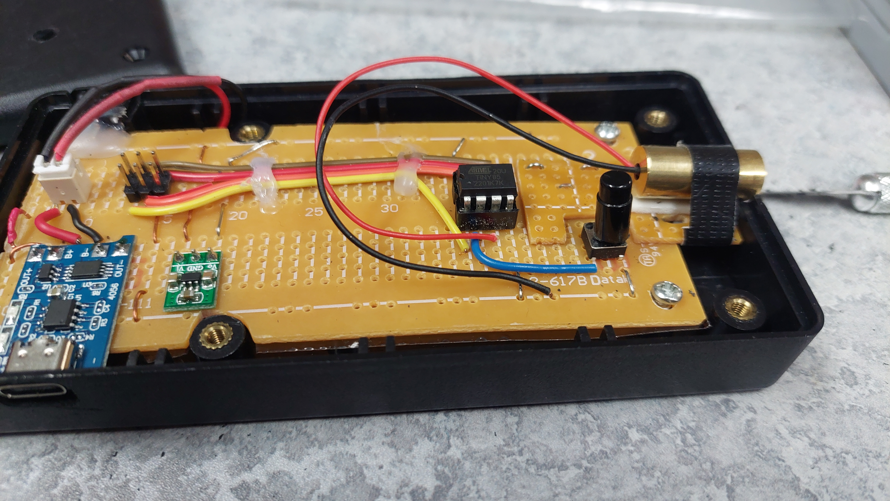
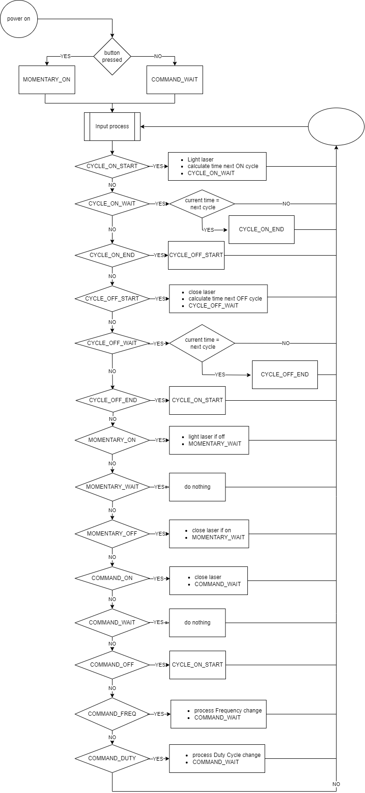

# ATTINY85 based project where a laser is blinking and controled by a button.

1. Laser is on PB4.
2. There is a button to stop/start is on PB3.
3 The system has 3 disctint modes :
  - **frequency blinking**
     - default mode when booting
     - it will cycle through ON and OFF state until button is pressed
     - button pressed will toggle cycle mode and command mode
  - **momentary on/off**
     - triggered by pressing button then powering on the unit
  - **command**
     - this mode is reached when in frequency blinking and stoping the cycle.
     - commands available are 
       - long press : frequency change : 5 -> 10 -> 15 -> 20 -> 5
       - double press : duty cycle change : 50% -> 40% - 30% -> 20% -> 10% -> 50%
     - to exit command mode, single button press to resume frequency blinking
4. The laser is fed directly from PB4.

chip is powered from a 3.7v lipo battery, adjusted to 3.3v with a buck boost converter

Library for button control : https://github.com/mathertel/OneButton

## Finite State machine engine
System is based on finite states, where a set of states are defined and used to achieve specifics tasks then to go to next.
There are 3 categories of states, namely
1. CYCLE
   - this is where the laser will be set on or off, depending of the states evolution 
2. COMMAND
   - Here we are waiting for the button press sequences to adjust the frequency or the duty cycle
3. MOMENTARY
   - the button controls directly the output state of the laser

